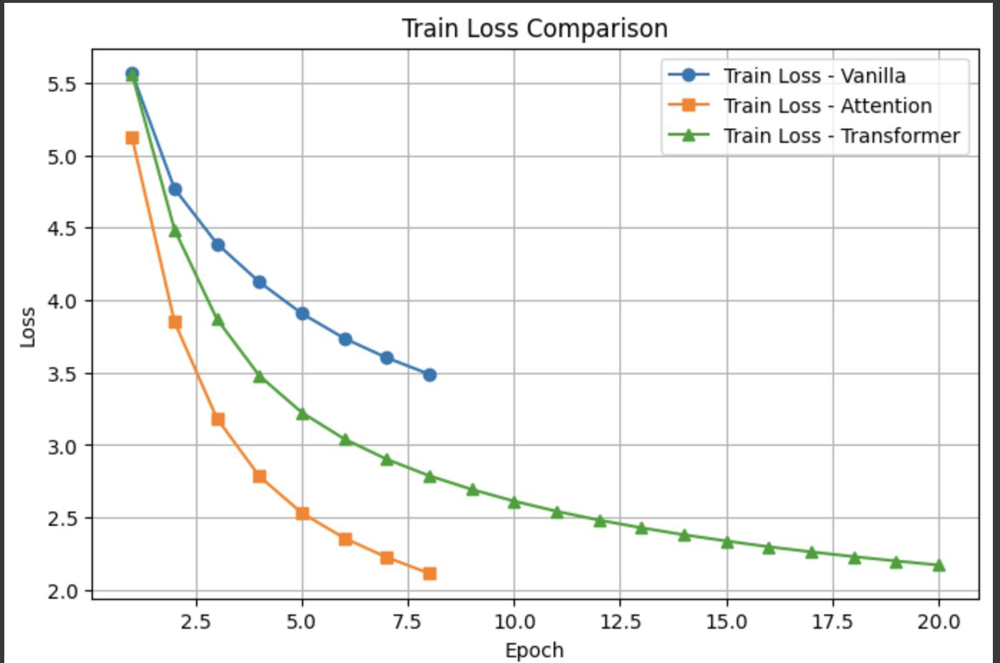
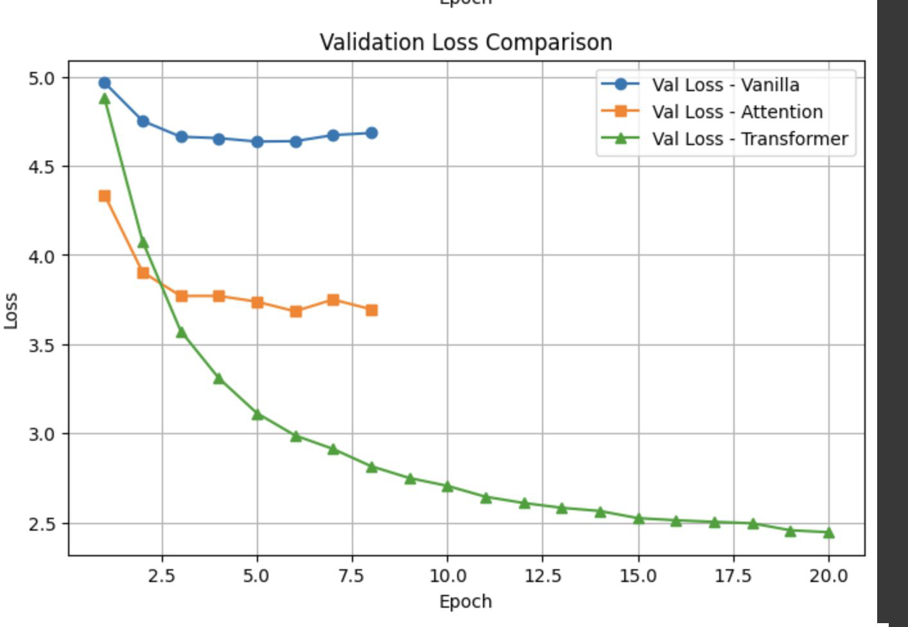

## Speech-to-Text

The speech-to-text ($\text{ASR}$) system utilizes a combination of models and decoding strategies to achieve real-time performance and accuracy.

---

### Models Used

The system employs two primary models based on the Connectionist Temporal Classification ($\text{CTC}$) architecture for alignment-free decoding.

- **$\text{RNN + CTC}$**: Uses **Sequential modeling** with $\text{RNNs}$ with $\text{CTC}$ for alignment-free decoding.
- **$\text{Conformer + CTC}$**: Combines **$\text{CNNs}$ and $\text{Transformers}$** for better feature learning and decoding with $\text{CTC}$.

---

### Evaluation Metrics

Performance is measured at both the word and character levels.

- **$\text{WER}$ ($\text{Word Error Rate}$)**: Measures the **proportion of word-level errors**.
- **$\text{CER}$ ($\text{Character Error Rate}$)**: Provides a **fine-grained error measure at the character level**.

---

### Decoding Strategies

Various strategies are used to generate the final transcription output.

- **Greedy**: A **fast** method that picks the highest probability tokens.
- **Beam Search**: **Explores multiple paths** for better accuracy.
- **$\text{LM}$ Integration**: Uses **external language models** for a refined output.

---

### Speech-to-Text Performance

The models were evaluated using $\text{Word Error Rate}$ ($\text{WER}$) and $\text{Character Error Rate}$ ($\text{CER}$).

| Model                        | Train Loss Trend                    | Val Loss Trend           | Final Test $\text{WER}$ | Final Test $\text{CER}$ |
| :--------------------------- | :---------------------------------- | :----------------------- | :---------------------- | :---------------------- |
| **$\text{Conformer + CTC}$** | Steady decrease, smooth convergence | Flattens after Epoch 6   | 30.28%                  | 8.50%                   |
| **$\text{RNN + CTC}$**       | Plateaus early around 2.6           | Fluctuates, remains high | 27.21%                  | 8.34%                   |

| Conformer + CTC                    | RNN + CTC                            |
| :--------------------------------- | :----------------------------------- |
|  |  |

---

## Text Translation Methodology

The text translation task focuses on translating **English to German** and progressively employs advanced sequence modeling techniques.

---

### Models Used

The models evolve from basic sequence-to-sequence learning to modern attention-based architectures.

- **Vanilla $\text{Seq2Seq}$**: An **Encoder-Decoder model** used for translating $\text{English}$ to $\text{German}$ using word-level tokens.
- **$\text{Seq2Seq}$ with $\text{Attention}$**: **Enhances translation** by allowing the decoder to focus on relevant input words dynamically.
- **$\text{Transformer}$**: Uses stacked **self-attention layers** to understand more complex patterns between all the words in the sequence.

---

### Evaluation Metrics

Translation quality is assessed using a standard metric:

- **$\text{BLEU Score}$**: Measures translation quality by **comparing generated sentences to reference translations** (higher is better).

---

### Decoding Strategies

Various techniques are employed during both training and inference to optimize translation output:

- **Greedy Decoding**: Picks the **most likely word at each step**; this method is fast but can miss optimal translations.
- **Teacher Forcing**: Used during training, it **uses the correct previous word** as input to the decoder for faster learning.
- **Attention Mechanism**: **Guides the decoder to focus on relevant input words** for better translation quality.

---

### Text Translation Performance

Translation quality was measured using the $\text{BLEU Score}$ (higher is better).

| Methods                                      | Test $\text{BLEU Score}$ | Translation quality                                                        |
| :------------------------------------------- | :----------------------- | :------------------------------------------------------------------------- |
| **Vanilla $\text{Seq2Seq}$**                 | $\sim$ 4                 | poor translations                                                          |
| **$\text{Seq2Seq}$ with $\text{Attention}$** | $\sim$ 12                | predictions are short, repetitive, and contains many $\text{<unk>}$ tokens |
| **$\text{Transformer}$**                     | $\sim$ 22                | **Fluent, accurate, close to reference**                                   |

| Training                            | Validation                            |
| :---------------------------------- | :------------------------------------ |
|  |  |
